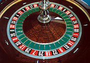

```{r setup, include=FALSE}
knitr::opts_chunk$set(echo = TRUE)
knitr::opts_chunk$set(cache=TRUE)
library(knitr)
library(tidyverse)
set.seed(09292020)
RouletteSpin <- function(num.spins){
  # function to simulate roulette spins
  # ARGS: number of spins
  # RETURNS: result of each spin
  outcomes <- data.frame(number = c('00','0',
                as.character(1:36)),
                color=c('green','green','red','black','red','black',
                        'red','black','red','black','red','black',
                        'black','red','black','red','black',
                        'red','black','red','red','black',
                        'red','black','red','black','red',
                        'black','red','black','black','red',
                        'black','red','black','red','black','red'))
  return(outcomes[sample(38,num.spins,replace=T),])
}
```

# Loops

## for loops 1
We have seen a few instances of for loops in this class, now consider these two statements.
\footnotesize
```{r}
rand.uniform2 <- runif(2)
rand.uniform2
```

```{r, eval=F}
for (i in 1:length(rand.uniform2)){
  print(i)
}
```


- what will each of these print?

## for loops 2
We have seen a few instances of for loops in this class, now consider these two statements.
\footnotesize
```{r}
rand.uniform2
```

```{r, eval=F}
for (i in rand.uniform2){
  print(i)
}
```


## for loops
We can loop through a sequence or a vector.
```{r}
for (i in 1:length(rand.uniform2)){
  print(i)
}

for (i in rand.uniform2){
  print(i)
}
```

## While loops
An alternative to for loops is to use the while statement.
\small
```{r}
set.seed(02012017)
total.snow <- 0
while (total.snow < 36){
  print(paste('need more snow, only have', 
              total.snow, 'inches'))
  total.snow <- total.snow + rpois(1,15)
}
  print(paste('okay, we now have', total.snow, 'inches'))
```

## Repeat Loops
Repeat loops are similar to while loops, but with the requirement that the expressions are evaluated at least once and require an explicit `break` statement.

```{r}
repeat{
  total.snow <- total.snow + rpois(1,15)
  print(paste('we have', total.snow, 'inches'))
  if (total.snow >= 36)
    break
}
```

## Exercise: Loops

Assume you plan to wager $1 on red for ten roulette spins. If the outcome is red you win a dollar and otherwise you lose a dollar. Write a loop that simulates ten rolls and determines your net profit or loss.

```{r}
#hint: to get color from a single spin use
RouletteSpin(1)[2]
```

## Solution: Loops

Assume you plan to wager $1 on red for ten roulette spins. If the outcome is red you win a dollar and otherwise you lose a dollar. Write a loop that simulates ten rolls and determines your net profit or loss.

```{r}
#hint: to get color use
profit <- 0
for (i in 1:10){
  ifelse(RouletteSpin(1)[2] == 'red',
         profit <- profit + 1, 
         profit <- profit - 1 )
}
profit
```


## Why not loops?
Some of you have seen or heard that loops in R should be avoided.

- **Why**: it has to do with how code is compiled in R. In simple terms, vectorized operations are much more efficient than loops.

- **How**: we have seen some solutions to this, explicitly using the apply class of functions. We can also write vectorized functions, consider the earlier roulette example where number of spins was an argument for the function.


# Simulation in R

## What is Simulation 
A few questions about simulation:

1. What does statistical simulation mean to you?

2. Describe a setting where simulation can be used.

## Simulation of Roulette
Consider the casino game Roulette.



We can use simulation to evaluate gambling strategies.

## Roulette Simulation in R
```{r roulette}
RouletteSpin <- function(num.spins){
  # function to simulate roulette spins
  # ARGS: number of spins
  # RETURNS: result of each spin
  outcomes <- data.frame(number = c('00','0',
                as.character(1:36)),
                color=c('green','green','red','black','red','black',
                        'red','black','red','black','red','black',
                        'black','red','black','red','black',
                        'red','black','red','red','black',
                        'red','black','red','black','red',
                        'black','red','black','black','red',
                        'black','red','black','red','black','red'))
  return(outcomes[sample(38,num.spins,replace=T),])
}
kable(RouletteSpin(2), row.names=F)
```


# Monte Carlo Procedures

## Motivation for Monte Carlo procedures
Some probabilities can easily be calculated either intuitively or using pen and paper; however, as we have seen we can also simulate procedures to get an approximate answer.

Consider poker, where players are dealt a hand of five cards from a deck of 52 cards. What is the probability of being dealt a full house?

## Full House Probability Calculation 
Could we analytically compute this probability? **Yes** Is it an easy calculation? not necessarily. So consider a (Monte Carlo) simulation.
```{r}
DealPoker <- function(){
  # Function returns a hand of 5 cards
  
  
  
  
}
  
```

## Full House Probability Calculation
Could we analytically compute this probability? **Yes** Is it an easy calculation, not necessarily. So consider a (Monte Carlo) simulation.
\footnotesize
```{r}
DealPoker <- function(){
  # Function returns a hand of 5 cards
  deck <- data.frame( suit = rep(c("H", "S","C","D"),each=13),
          card = rep(c('A',2:10,'J',"Q",'K'),4) )  
  return(deck[sample(52,5),])
}
```

## Full House Probability Calculation 
Next write another function to check if the hand is a full house.
\footnotesize
```{r}
IsFullHouse <- function(hand){
  #determines whether a hand of 5 cards is a full house
  #ARGS: data frame of 5 cards
  #RETURNS: TRUE or FALSE
  cards <- hand[,2]
  num.unique <- length(unique(cards))
  ifelse(num.unique == 2, return(TRUE),return(FALSE)) 
}
```
Does this work? If not, what is the problem and how do we fix it?

## Full House Probability Calculation
\footnotesize
```{r}
IsFullHouse <- function(hand){
  #determines whether a hand of 5 cards is a full house
  #ARGS: data frame of 5 cards
  #RETURNS: TRUE or FALSE
  cards <- hand[,2]
  num.unique <- length(unique(cards))
  num.appearances <- aggregate(rep(1,5),
                               list(cards),sum)
  max.appearance <- max(num.appearances[,2])
  ifelse(num.unique == 2 & max.appearance ==3,
         return(TRUE),return(FALSE)) 
}
```

## Full House Probability Calculation
```{r}
num.sims <- 1e5
sim.hands <- replicate(num.sims,DealPoker()
                       ,simplify=F)
results <- lapply(sim.hands,IsFullHouse)
prob.full.house <- sum(unlist(results))/num.sims
```
Analytically the probability of getting a full house *can* be calculated as approximately 0.00144, with our simulation procedure we get `r prob.full.house`.

## Closing Thoughts on Monte Carlo
A few facts about Monte Carlo procedures:

- They return a random result due to randomness in the sampling procedures.
- The run-time (or number of iterations) is fixed and typically specified.
- Mathematically, Monte Carlo procedures are computing an integral or enumerating a sum.
- They take advantage of the law of large numbers
- They were given the code name Monte Carlo in reference to the Monte Carlo Casino in Monaco. 


## Exercise: Probability of Red, Green, and Black
1. Calculate/Derive the probability of landing on green, red, and black.

2. How can the `RouletteSpin()` function be used to compute or approximate these probabilities?

## Solution: Probability of Red, Green, and Black

In this situation, it is easy to compute the probabilities of each color analytically. However, consider simulating this process many times to estimate these probabilities.
```{r rouletteSpins}
num.sims <- 1000
spins <- RouletteSpin(num.sims)
p.red <- sum(spins[,2] == 'red') / num.sims
p.black <- sum(spins[,2] == 'black') / num.sims
p.green <- sum(spins[,2] == 'green') / num.sims
```
Analytically $P[red] = \frac{18}{38} =$ `r round(18/38,4)`, this is estimated as `r round(p.red,4)`. Similarly, $P[black] = \frac{18}{38} =$ `r round(18/38,4)`, this is estimated as `r round(p.black,4)` and $P[green] = \frac{2}{38} =$ `r round(2/38,4)`, this is estimated as `r round(p.green,4)`

## Exercise: Simulation Questions - Part 2 

Now what happens if we:

1. run the simulation again with the same number of trials?

2. run the simulation with more trials, say 1 million?

## Solution: Simulation Questions - Part 2

Now what happens if we:

1. run the simulation again with the same number of trials?
\footnotesize
```{r }
num.sims <- 1000
spins <- RouletteSpin(num.sims)
p.red <- sum(spins[,2] == 'red') / num.sims
p.black <- sum(spins[,2] == 'black') / num.sims
p.green <- sum(spins[,2] == 'green') / num.sims
```
The simulated results are different
Analytically $P[red] = \frac{18}{38} =$ `r round(18/38,4)`, this is estimated as `r round(p.red,4)`. Similarly, $P[black] = \frac{18}{38} =$ `r round(18/38,4)`, this is estimated as `r round(p.black,4)` and $P[green] = \frac{2}{38} =$ `r round(2/38,4)`, this is estimated as `r round(p.green,4)`

## Solution: Simulation Questions - Part 2

2. run the simulation with more trials, say 1 million?

```{r }
num.sims <- 1000000
spins <- RouletteSpin(num.sims)
p.red <- sum(spins[,2] == 'red') / num.sims
p.black <- sum(spins[,2] == 'black') / num.sims
p.green <- sum(spins[,2] == 'green') / num.sims
```
Analytically $P[red] = \frac{18}{38} =$ `r round(18/38,4)`, this is estimated as `r round(p.red,4)`. Similarly, $P[black] = \frac{18}{38} =$ `r round(18/38,4)`, this is estimated as `r round(p.black,4)` and $P[green] = \frac{2}{38} =$ `r round(2/38,4)`, this is estimated as `r round(p.green,4)`


